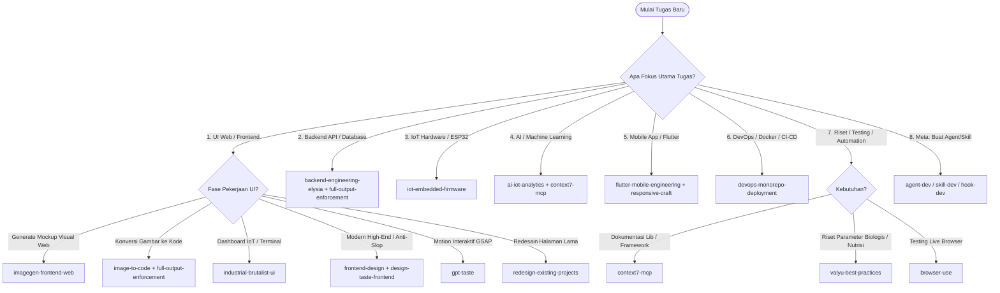

# 🧭 Panduan & Direktori Penggunaan Skill (.agents/skills)

Dokumen ini adalah panduan resmi alur kerja (*decision guide*) untuk menentukan **kapan, mengapa, dan kombinasi skill apa** yang harus diaktifkan dalam pengembangan seluruh ekosistem **UrbanGrow Smart Aquaponics**.

---

## 🎯 Quick Matrix: Skenario vs Skill yang Dipilih

| Area / Skenario Pengembangan | Rekomendasi Skill Utama | Skill Pendukung / Pairing |
|---|---|---|
| **Backend REST API, Drizzle ORM, TimescaleDB, ElysiaJS** | `backend-engineering-elysia` | `context7-mcp`, `full-output-enforcement` |
| **Real-time WebSocket / SSE Telemetri Sensor** | `backend-engineering-elysia` | `flutter-mobile-engineering`, `frontend-design` |
| **Firmware ESP32, Kalibrasi Sensor & Relay Aktuator** | `iot-embedded-firmware` | `backend-engineering-elysia` |
| **AI Deteksi Anomali, Prediksi Panen, FastAPI (`services/ai-engine`)** | `ai-iot-analytics` | `valyu-best-practices`, `context7-mcp` |
| **Aplikasi Mobile Flutter, Riverpod, Gauge UI (`apps/mobile`)** | `flutter-mobile-engineering` | `imagegen-frontend-mobile`, `responsive-craft` |
| **Docker Compose, TimescaleDB Init, Moonrepo CI/CD** | `devops-monorepo-deployment` | `backend-engineering-elysia` |
| **Membangun UI Web Baru (`apps/web`)** | `frontend-design`, `design-taste-frontend` | `high-end-visual-design`, `responsive-craft` |
| **Data-Dense IoT Dashboard / Terminal Web** | `industrial-brutalist-ui` | `full-output-enforcement` |
| **Clean & Editorial Web UI** | `minimalist-ui` | `responsive-craft` |
| **Advanced Web Motion & Animasi GSAP** | `gpt-taste` | `design-taste-frontend` |
| **Sistem Desain & Token UI (Design System)** | `stitch-design-taste` | `high-end-visual-design` |
| **Generate Konsep UI / Desain Gambar Web** | `imagegen-frontend-web` | `image-to-code` |
| **Generate Konsep UI Mobile (`apps/mobile`)** | `imagegen-frontend-mobile` | `brandkit` |
| **Implementasi Desain Gambar ke Kode** | `image-to-code` | `full-output-enforcement` |
| **Redesain / Upgrade Tampilan Eksisting** | `redesign-existing-projects` | `design-taste-frontend` |
| **Responsivitas & Adaptasi Mobile/Desktop** | `responsive-craft` | `browser-use` |
| **Identitas Visual, Logo & Brand Guidelines** | `brandkit` | `imagegen-frontend-web` |
| **Integrasi Framework / Referensi Dokumentasi** | `context7-mcp` | `valyu-best-practices` |
| **Riset Data Ilmiah / Tanaman / Ikan / API** | `valyu-best-practices` | `context7-mcp` |
| **Automasi Testing Web & Browser** | `browser-use` | `responsive-craft` |
| **Koding Tanpa Truncation / Placeholder** | `full-output-enforcement` | *Semua tugas koding kompleks* |
| **Integrasi MCP Server Baru** | `mcp-integration` | `hook-development` |
| **Membuat/Mengubah Agent, Hook, atau Skill** | `agent-development`, `hook-development`, `skill-development` | `find-skills` |

---

## 🌳 Decision Tree: Memilih Skill yang Tepat

---

## 📚 Katalog Lengkap 27 Skill & Petunjuk Penggunaan

### 🚀 Kategori A: Backend, Hardware & Engineering Inti UrbanGrow

#### 1. `backend-engineering-elysia` ⭐ *(Spesialis Backend)*
- **Fokus**: ElysiaJS (Bun), TypeBox validation, standardized response envelopes, Drizzle ORM, TimescaleDB time-series, live WebSocket telemetry streaming, dan aktuator threshold evaluation.
- **Kapan Digunakan**: Mengembangkan/refactoring endpoint REST API di [`services/backend`](file:///c:/Users/Rey%20Cannavaro/urbangrow-workspace/services/backend), query database, dan Eden Treaty type sharing.

#### 2. `iot-embedded-firmware` ⭐ *(Spesialis Hardware & ESP32)*
- **Fokus**: Firmware C++/Arduino & MicroPython untuk ESP32, kalibrasi sensor analog (pH-4502C, TDS temperature-compensated), 1-Wire DS18B20, I2C BME280/BH1750, isolated relay controls, WiFi reconnection resilience, dan hardware watchdog timer.
- **Kapan Digunakan**: Menulis atau menguji kode firmware mikrokontroler sensor dan aktuator di kolam aquaponics.

#### 3. `ai-iot-analytics` ⭐ *(Spesialis AI & Data Science)*
- **Fokus**: Layanan analitik FastAPI di [`services/ai-engine`](file:///c:/Users/Rey%20Cannavaro/urbangrow-workspace/services/ai-engine), deteksi anomali multi-sensor (Isolation Forest + threshold), model estimasi panen XGBoost, dan optimasi dosis nutrisi biologis.
- **Kapan Digunakan**: Membangun algoritma prediksi, model machine learning, dan endpoint inferensi untuk kesehatan tanaman/ikan.

#### 4. `flutter-mobile-engineering` ⭐ *(Spesialis Mobile App)*
- **Fokus**: Arsitektur modular Flutter 3.x/Dart di [`apps/mobile`](file:///c:/Users/Rey%20Cannavaro/urbangrow-workspace/apps/mobile), Riverpod state management, auto-reconnecting WebSocket stream, custom circular gauges, level tank animasi, dan actuator toggles dengan optimistic UI.
- **Kapan Digunakan**: Mengembangkan aplikasi smartphone monitoring dan kontrol aquaponics untuk Android/iOS.

#### 5. `devops-monorepo-deployment` ⭐ *(Spesialis DevOps & Monorepo)*
- **Fokus**: Multi-container Docker Compose (TimescaleDB hypertable init, Mosquitto MQTT, backend, AI engine), Moonrepo workspace orchestration (`moon run :dev`), CI/CD GitHub Actions, dan deployment ke edge device (Raspberry Pi/Mini PC).
- **Kapan Digunakan**: Menyiapkan environment lokal, konfigurasi database, pipeline build otomatis, atau deploy sistem ke greenhouse.

---

### 🎨 Kategori B: Desain Visual, Taste & Frontend Engineering

#### 6. `frontend-design`
- **Fokus**: Desain visual berkelas, tipografi modern, micro-interaction, dan palet warna harmonis untuk Next.js (`apps/web`).

#### 7. `design-taste-frontend` (v2)
- **Fokus**: Filosofi *Anti-Slop*, membaca intensi brief, kalkulasi rasio Dial Variance/Motion/Density, dan eliminasi pola generic AI.

#### 8. `design-taste-frontend-v1`
- **Fokus**: Versi legacy taste frontend untuk backward compatibility.

#### 9. `high-end-visual-design`
- **Fokus**: Standar visual agency papan atas (rasio spacing, shadow bertingkat, tipografi berjenjang, border treatment).

#### 10. `gpt-taste`
- **Fokus**: Animasi interaktif tingkat lanjut menggunakan GSAP (ScrollTrigger, pinning, scrub animations, card stacking).

#### 11. `stitch-design-taste`
- **Fokus**: Pembuatan semantic design system terstruktur (`DESIGN.md`), variabel warna, dan typography tokens.

#### 12. `industrial-brutalist-ui`
- **Fokus**: Tampilan mekanikal, Swiss print typography, grid rigid, status telemetri data-dense, dark terminal aesthetics. Sangat cocok untuk **IoT Telemetry Dashboard**.

#### 13. `minimalist-ui`
- **Fokus**: Desain monokromatik hangat, tipografi kontras tinggi, bento grid datar, tanpa shadow/gradient berat.

#### 14. `redesign-existing-projects`
- **Fokus**: Mengaudit UI eksisting dan merombak tampilan yang terasa template menjadi berkarakter tanpa merusak fungsi.

#### 15. `responsive-craft`
- **Fokus**: Adaptasi multi-breakpoint (HP, tablet, laptop, ultrawide), sticky elements, dan optimasi tata letak responsive.

---

### 🖼️ Kategori C: Image Generation & Asset Creation

#### 16. `imagegen-frontend-web`
- **Fokus**: Generate referensi visual UI web per section (16:9) dengan komposisi bervariasi sebelum mulai koding.

#### 17. `imagegen-frontend-mobile`
- **Fokus**: Generate mockup layar aplikasi mobile dengan framing smartphone elegan untuk referensi UI Flutter.

#### 18. `image-to-code`
- **Fokus**: Menganalisis gambar mockup visual lalu mereproduksinya secara presisi ke dalam kode frontend.

#### 19. `brandkit`
- **Fokus**: Panduan identitas brand, desain logo, moodboard, dan palet warna resmi ekosistem UrbanGrow.

---

### ⚡ Kategori D: Core Engineering, Accuracy & Automation

#### 20. `full-output-enforcement`
- **Fokus**: Mencegah pemotongan kode (truncation) dan melarang placeholder (`// TODO: ...`). Wajib untuk pembuatan file kode besar/lengkap.

#### 21. `context7-mcp`
- **Fokus**: Mengambil dokumentasi resmi, API reference, dan best practice kode untuk library/framework modern.

#### 22. `valyu-best-practices`
- **Fokus**: Riset data real-time, sumber akademik/teknis, dan parameter biologis aquaponics.

#### 23. `browser-use`
- **Fokus**: Otomasi browser interaktif, navigasi halaman, pengisian form, pengujian UI live, dan screenshot.

---

### 🛠️ Kategori E: Ekstensi Agent, Tooling & Customizations

#### 24. `mcp-integration`
- **Fokus**: Konfigurasi dan integrasi Model Context Protocol (stdio, SSE, HTTP) ke dalam workspace.

#### 25. `hook-development`
- **Fokus**: Pembuatan automasi event-driven seperti `PreToolUse`, `PostToolUse`, dan guardrails keamanan.

#### 26. `agent-development`
- **Fokus**: Menulis dan mengonfigurasi subagent otonom baru (system prompts, tools, trigger conditions).

#### 27. `skill-development`
- **Fokus**: Standar pembuatan file `SKILL.md` baru dengan arsitektur progressive disclosure.
- **Kapan Digunakan**: Ketika ada workflow baru yang ingin dibakukan menjadi skill permanen.

#### 28. `find-skills`
- **Fokus**: Pencarian dan instalasi skill dari direktori eksternal.

---

## 💡 Best Practice & Rekomendasi Eksekusi Proyek UrbanGrow

1. **Hardware Node (ESP32)**:
   - Gunakan `iot-embedded-firmware` untuk flashing dan kalibrasi ADC sensor pH/TDS sebelum dihubungkan ke kolam.
2. **Backend & Telemetri (`services/backend`)**:
   - Gunakan `backend-engineering-elysia` + `context7-mcp` + `full-output-enforcement`.
3. **AI Predictor (`services/ai-engine`)**:
   - Gunakan `ai-iot-analytics` bersama `valyu-best-practices` untuk model deteksi anomali biologis.
4. **Mobile Control (`apps/mobile`)**:
   - Gunakan `flutter-mobile-engineering` + `responsive-craft` untuk antarmuka Riverpod + WebSocket.
5. **Web Monitoring (`apps/web`)**:
   - Gunakan `industrial-brutalist-ui` atau `frontend-design` dipadukan dengan Eden Treaty dari backend.
6. **Infrastructure & Deployment**:
   - Gunakan `devops-monorepo-deployment` untuk menjalankan Docker Compose (TimescaleDB + Mosquitto + Services) secara lokal.
